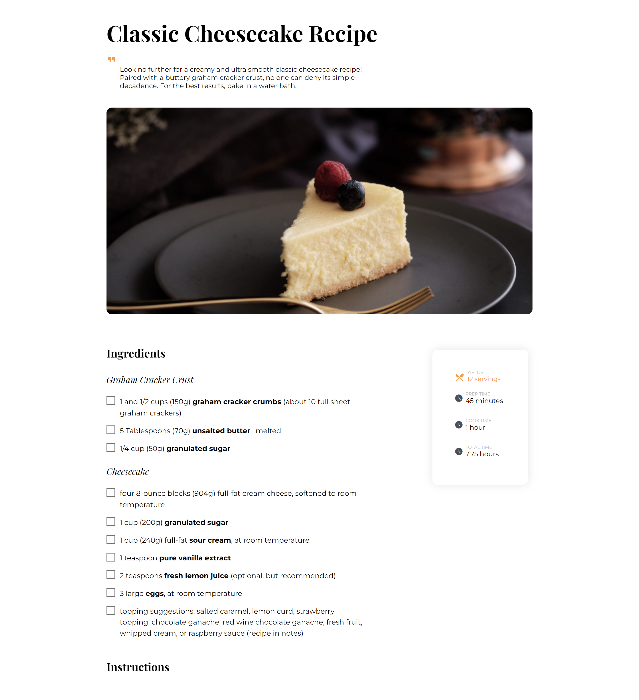

<!-- Please update value in the {}  -->

<h1 align="center">{Recipe project}</h1>

   Solution for a challenge from  <a href="http://devchallenges.io" target="_blank">Devchallenges.io</a>.

  <h3>
    <a href="https://xxtbmfxx.github.io/recepi-blog/">
      Demo
    </a>
     | 
    <a href="https://github.com/XxtbmfxX/recepi-blog">
      Solution
    </a>
     | 
    <a href="https://devchallenges.io/challenges/OEKdUZ6xs0h99C38XVht">
      Challenge
    </a>
  </h3>

<!-- TABLE OF CONTENTS -->

## Table of Contents

- [Overview](#overview)
  - [Built With](#built-with)
- [Features](#features)
- [Comemnts](#comments)

<!-- OVERVIEW -->

## Overview

### Built With

HTML JS CSS

## Features

This application/site was created as a submission to a [DevChallenges](https://devchallenges.io/challenges) challenge. The [challenge](https://devchallenges.io/challenges/TtUjDt19eIHxNQ4n5jps)

## Comments

- I shoul use markdown next time
